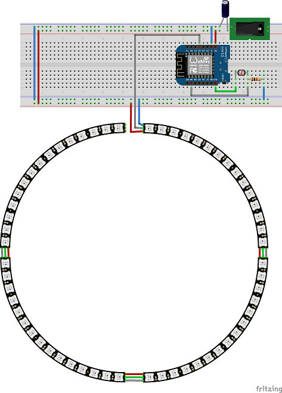

# NeoPixelRingClock

Dieses Projekt verwendet die Adafruit NeoPixel-Bibliothek, um einen 60-LED-NeoPixel-Ring als Uhr zu steuern.

## Features
* Anzeige der Uhrzeit durch blaue Marker
* Anzeige von Stundenmarkierungen
* Helligkeitssensor wechselt zwischen Day & Night Modus
* WebServer auf dem ESP zeigt die aktuelle Configuration & Urhzeit

## Geplante Features
* Einstellen einer Alarmzeit
* Die Alarmzeit wird durch eine rote Markierung zusätzlich zur Uhrzeit anzeigt
* Rest / HTML API zum steuern / einstellen der Uhr per Smartphone
* Dokumentation per Fritzing Hardware Beispiel

Für geplante Features und Änderungen siehe [CHANGELOG.md](https://github.com/jenszech/NeoPixelRingClock/blob/master/CHANGELOG.md)

# Dokumentation

## Software

Enter `https://arduino.esp8266.com/stable/package_esp8266com_index.json` into *Additional Board Manager URLs* field. Open Boards Manager from Tools > Board menu and find *esp8266* platform and install Version 2.7.4

### Erforderliche Bibliotheken

Über Bibliotheksmanager installieren
* NTPClient  - by Fabrice Weinberg - Version 3.2.0
* Adafruit NeoPixel - by Adafruit - Version 1.1.7
* WifiManager - by tzapu, tablatronix - Version 0.16.0
* Time - by Michael Margolis - Version 1.6.0
  - Beispiele unter TimeLib by Paul Stoffregen
    https://github.com/PaulStoffregen/Time
* EspHtmlTemplateProcessor - by Patrick Lapointe - Version 1.2.1
* NeoPixelBus - by Micheal C. Miller - Version 2.5.7 

Manuell zu installieren

* ESP8266FS - https://github.com/esp8266/arduino-esp8266fs-plugin

Wenn der EPS8266FS erfolgreich installiert wurde, muss einmal im "Tools" Menü die Funktion "ESP8266 Sketch Data Upload" ausgeführt werden. Falles Probleme dabei gibt, vorher einmal die USB Verbindung zum EPS trennen und wieder anschließen.

## Hardware

###  Erforderliche Teile

* 4 x Neo Pixel 1/4 Ringe (je 15 LEDs)  [Link](https://de.aliexpress.com/item/4000102576864.html?spm=a2g0s.9042311.0.0.48fe4c4doc7WPP) 
* 1 x ESP8266-Modul. Ich benutze den WeMos D1 mini
* 1 x LDR GL5528
* 1 x 1k Ohm Widerstand
* 1 * 1000uF 10V Kondensator
* 1 * 5V Netzteil >= 3A [Link1](https://www.amazon.de/gp/product/B01HRR9GY4/ref=ppx_yo_dt_b_search_asin_title?ie=UTF8&psc=1) [Link2](https://de.aliexpress.com/item/32803238789.html?spm=a2g0s.9042311.0.0.48fe4c4doc7WPP)

### Hardware Layout

Erstellt mit Fritzing https://fritzing.org/

Erforderliche Fritzing Bibliotheken: https://github.com/adafruit/Fritzing-Library

Layout dieses Projektes als Fritzing Datei: [HWLayout](https://github.com/jenszech/NeoPixelRingClock/blob/master/src/Layout/HWLayout.fzz)

#### Steckplatine

#### Schaltplan

# Sonstiges

## Contributing

Please read [CODE_OF_CONDUCT.md](https://github.com/jenszech/NeoPixelRingClock/blob/master/CODE_OF_CONDUCT.md) for details on our code of conduct, and the process for submitting pull requests to us.

## Versioning

We use [SemVer](http://semver.org/) for versioning. For the versions available, see the [tags on this repository](https://github.com/your/project/tags).

## Authors

- **Jens Zech** - *Project owner* - [GitHub Profil](https://github.com/jenszech)
- Florian Adam - Contributor- [GitHub Profil](https://github.com/xfadam)

See also the list of [contributors](https://github.com/jenszech/NeoPixelRingClock/contributors) who participated in this project.

## License

This project is licensed under the MIT License - see the [LICENSE.md](https://github.com/jenszech/NeoPixelRingClock/blob/master/LICENSE.md) file for details

